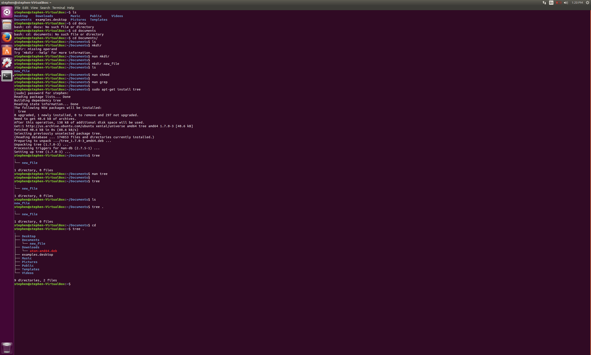

## Asking and Answering Questions
1. Make sure that if you find the answer to a question or are able to answer the question, make that answer as public as possible.  This can be done by having the person originally posting adding the answer to the original question post.  This will make this question easier to search for and have the answer publicly available.
2. If you are answering a question that involves code, provide examples or snippets of code that are well formatted and clearly display the language that is being used.  Many languages can look similar, and providing if an answer is in C++, C#, or C will be very helpful to someone looking for answers.

##Response to Free Culture
Jesse Jordan's story about developing a search engine to scour RPI's network for files hosted by other students is interesting because it shows that Open Source is still misunderstood.  Jesse's goal was to just tinker with something that he was interested in and gain some experience, but this ended with him having to pay $12,000 to the RIAA. This is unfortunate in my eyes, because seeing this is discouraging to anyone who wants to tinker with and modify programs.  What Jesse did was a public service to RPI students allowing them to access files from school computers or away locations with ease.  However if every person who wants to modify a piece of code is subject to a copyright lawsuit, nothing will ever improve.  Jesse did not condone or encourage piracy, yet was sued for it non the less.  He did not upload the files for others to download and share illegally.  This also shows the nature of the RIAA, in that the amount of money did not matter to them, just that they destroyed Jesse's reputation and gave him a hard time.

##Tree

##Regex

##Blockly

